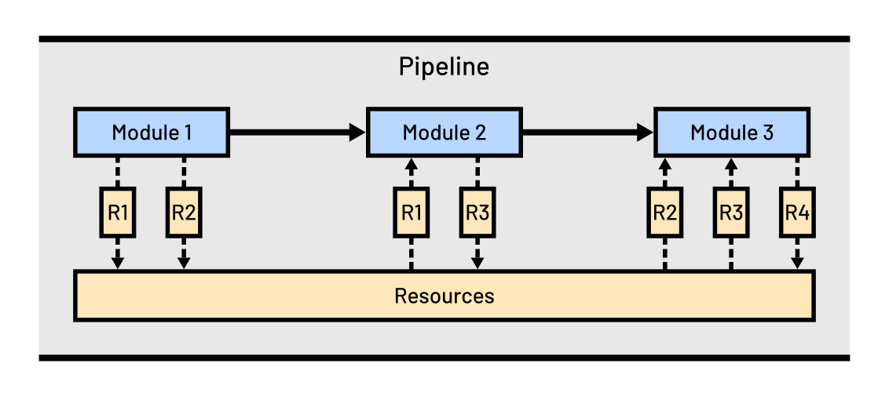

.. _architecture:

Architecture
============

Pipeline Architecture
---------------------

`LIFEsimMC` features a `pipeline` architecture. `Modules` can be added to the pipeline and are executed in the order they are added.
Information exchange between the modules is handled via `resources`. Once a resource is created, it is added to the
pipeline's collection of resources, from which it can be accessed by all successive modules. The image below illustrates
this:

Class Diagram
-------------
TBD