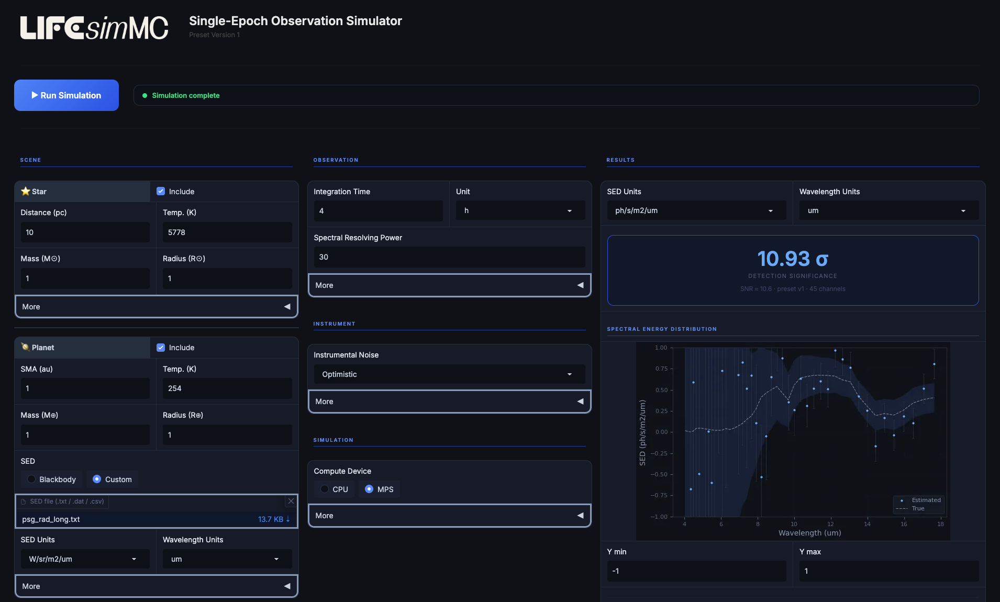

.. _seo:

Single-Epoch Observations
=========================

The **single-epoch observation preset** provides a straightforward way to simulate a measurement as expected by the **current
reference architecture of LIFE**. This includes the generation of synthetic data including instrumental noise, data post-processing,
and several tools for signal extraction.

For a **detailed documentation of the architecture and the corresponding instrument parameters** see the
:doc:`SingleEpochObservation <../source/presets/seo>` class documentation.

.. hint::
    A **public web interface** is available for ``LIFEsimMC``, providing access to the **GUI for the single-epoch observation** preset.
    See below for more information.

    .. raw:: html

       

         <a class="button" href="https://huggingface.co/spaces/pahuber/LIFEsimMC-Test" target="_blank">
           Go to Public Web Interface (Beta)
         </a>
       

Running a Single-Epoch Observation
----------------------------------

The singe-epoch observation preset requires the **specification of the astrophysical scene**, including information on the
target star, exozodiacal dust, and the observed planet. Additionally, the **integration time** for the observation must be specified.

.. note::
    For a documentation of all configurable parameters and default values, check out the :doc:`SingleEpochObservation <../source/presets/seo>` class documentation.

The easiest way to run a single-epoch observation simulation with ``LIFEsimMC`` is through the GUI.
This can be done through the `public web interface <https://huggingface.co/spaces/pahuber/LIFEsimMC-Test>`_ or by running it locally.
However, it can also be run in a regular Python script through the Python API.

Graphical User Interface (GUI)
~~~~~~~~~~~~~~~~~~~~~~~~~~~~~~

To run the GUI (see screenshot below) locally (after `installing LIFEsimMC <../installation.rst>`_), open a console and run the following command:

.. code-block:: console

    lifesimmc-gui

The single-epoch observation simulator will then be hosted locally on your machine and you can just click on `http://127.0.0.1:7861 <http://127.0.0.1:7861>`_
to open it. Alternatively, you can open a browser and manually navigate to `http://127.0.0.1:7861 <http://127.0.0.1:7861>`_. A screenshot of the GUI
is shown in the figure below.

.. _fig-gui:

   Screenshot of the GUI of the single-epoch observation simulator.

After specification of the astrophysical scene and the integration time (and optionally other parameters), the full simulation
can directly be run by clicking the "Run Simulation" button. The estimated planet SED and several other outputs are then displayed in the GUI.
All outputs can be downloaded as ``numpy`` arrays from within the GUI.

Python API
~~~~~~~~~~

All results offered by the GUI can also be accessed through the Python API. The following notebook illustrates how to
setup the astrophysical scene, run the single-epoch observation and plot all results.

.. include:: seo_api.ipynb
   :parser: myst_nb.docutils_

.. note::
    It is recommended to run ``LIFEsimMC`` on a GPU, as the simulation gets computationally expensive quickly and may take a substantial amount of time on CPUs.
